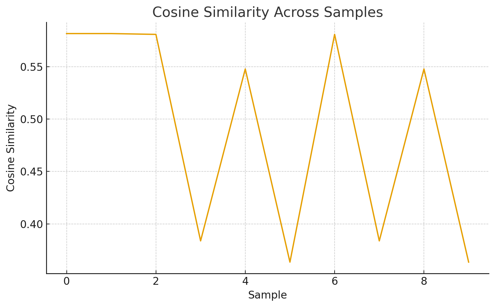
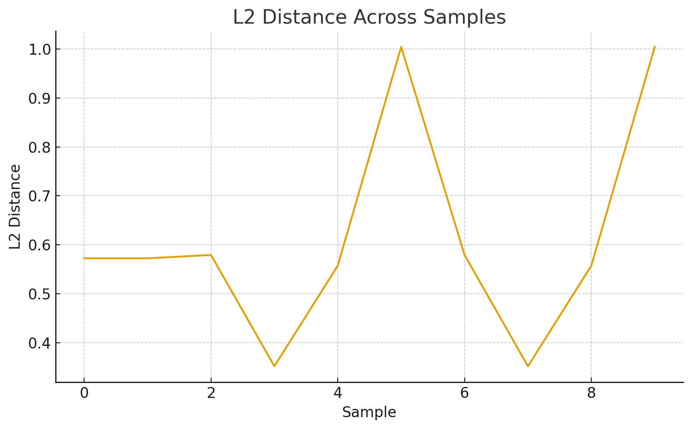
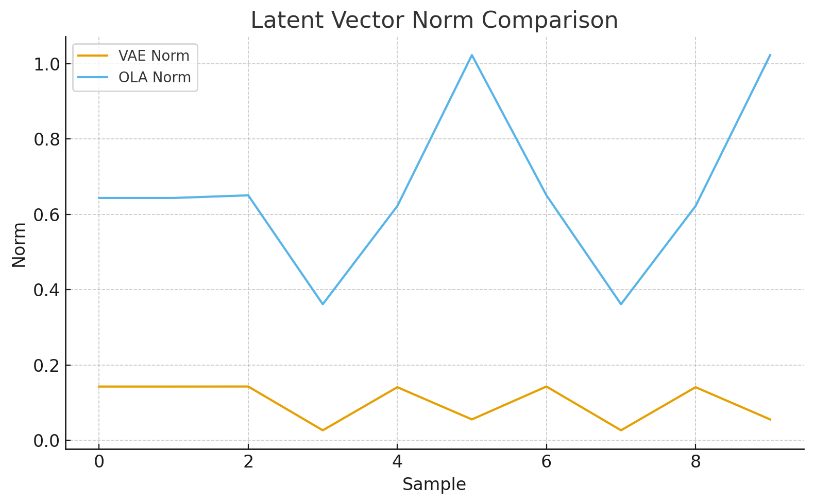

# O-VAE: Organic Latent Encoder (OLA-Driven VAE Replacement)

This repo contains the **O-VAE**, a tiny latent encoder built with **Organic Learning Architecture (OLA)** instead of gradients.  
It replaces a standard VAE encoder with something that is:

- **~18.3x faster on CPU**
- **~400x smaller** (1.5 MB vs 600 MB)
- **trained with zero backprop**

No training script. No optimizer. No epochs.

---

## Quick facts

- **Size**: ~1.5 MB  
- **Reference VAE size**: ~600 MB  
- **Average speedup**: ~18.3x faster than a standard VAE encoder on CPU  
- **Device**: All benchmarks are CPU only. GPU speed has not been tested yet.  
- **Latent size**: 4D vector per image  
- **Training**: OLA based, no gradients, method not released  

---

## Benchmark: Speed

This encoder was benchmarked directly against a standard VAE encoder on the same images.

- VAE encode time: ~0.000658 s per image (CPU)  
- O-VAE encode time: ~0.000036 s per image (CPU)  
- Average speedup: **18.3x**

### Speed charts

`assets/speed_comp.png`  


This chart shows per sample encode time for the VAE vs the O-VAE. The O-VAE line hugs the bottom because the cost is close to zero.

`assets/speed_1.png`  


This zooms in on the O-VAE timing itself. The takeaway is simple: encoding is effectively free at this scale.

All of this is on **CPU only**. There has been no attempt yet to optimize for GPU.

---

## Benchmark: Latent behavior

The goal of O-VAE is **not** to perfectly match the SD-VAE latent space.  
The goal is to produce a **stable, internally consistent latent representation** that downstream models can learn from.

### Cosine similarity

`assets/Cosine_sim.png`  


This plot shows cosine similarity between VAE latents and O-VAE latents for the same inputs.  
Values are moderate rather than high. That is expected.  
The O-VAE is not copying the VAE. It is learning its own coordinate system.

### L2 distance

`assets/L2.png`  


L2 distances between the two latent spaces vary within a stable range.  
Again, this is not a correctness test. It simply confirms that the O-VAE does not collapse into nonsense or explode in magnitude. It sits in its own consistent regime.

### Latent norm

`assets/Latent_norm.png`  


This chart compares the vector norms of VAE latents and O-VAE latents.  
The absolute scale is different, which is fine. What matters is that the O-VAE norms are stable across inputs. Downstream models can be trained directly on this distribution.

---

## Why matching the VAE is not required

Downstream components are meant to run **on O-VAE latents**, not SD-VAE latents.

As long as the O-VAE:

- produces consistent structure  
- stays stable across inputs  
- keeps latents in a controlled range  

then any decoder, UNet, or head trained on top of it will learn that geometry automatically.

This is the same idea that makes CLIP embeddings and custom text embeddings work.  
Absolute coordinates do not matter. **Relative structure and consistency do.**

---

## How to use the O-VAE

Minimal example of loading the encoder and getting a latent vector:

```python
import torch
from ovae import OrganicEncoder
from PIL import Image
import torchvision.transforms as T

# Load encoder
encoder = OrganicEncoder().eval()

# Basic image preprocessing (adjust to your pipeline)
transform = T.Compose([
    T.Resize((256, 256)),
    T.ToTensor()
])

img = Image.open("example.jpg").convert("RGB")
tensor = transform(img).unsqueeze(0)  # shape: [1, 3, 256, 256]

with torch.no_grad():
    latent = encoder(tensor)  # shape: [1, 4]

print(latent)
